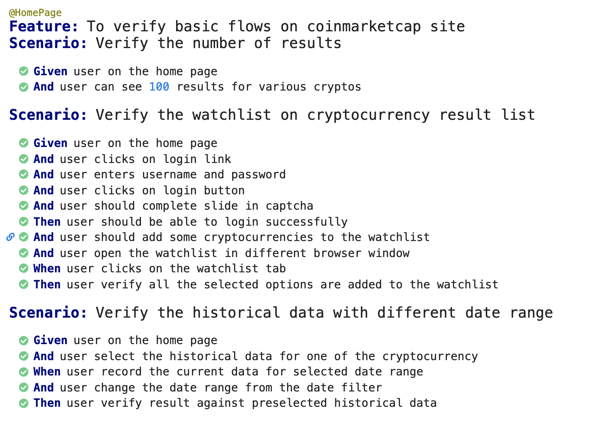

# VS_Assignment_web

Created using Java selenium and Cucumber BDD framework for UI

### prerequisite
you should have java 11 and gradle 6.X installed

#### Steps to run the tests

1. Take a pull
2. ```gradle build``` will build the project and bring all the dependencies and run the tests as well
3. Also you should be able to run the scenarios by using ```TestRunner.java``` file or you can run the scenario straight from the feature file

#### Reporting

For the run you should be able to see the reports as enlisted below


